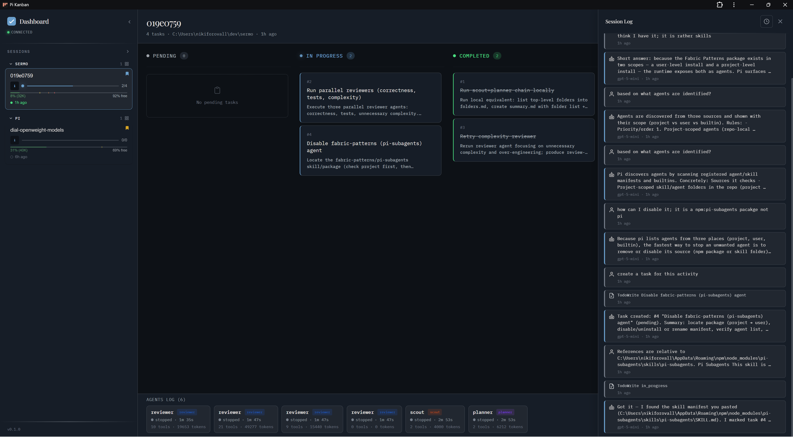
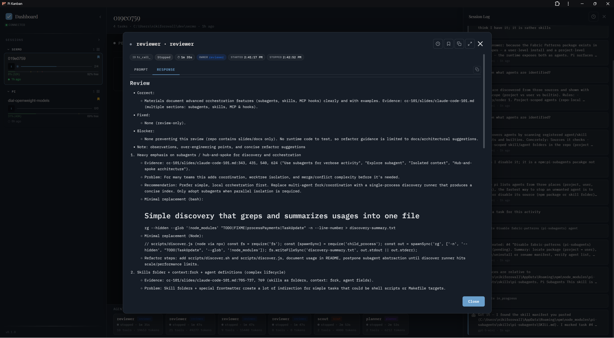
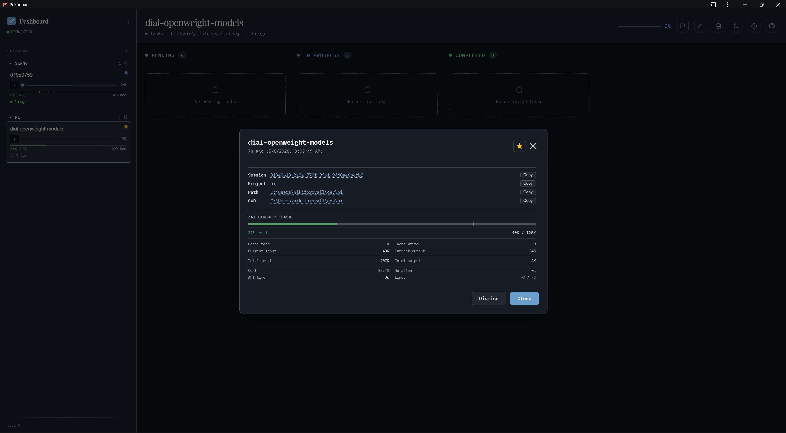
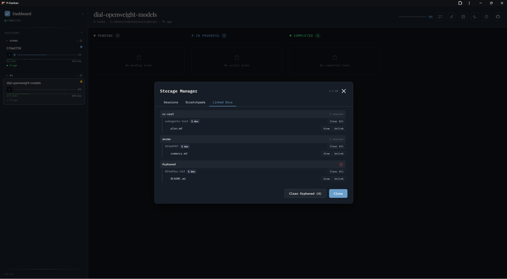
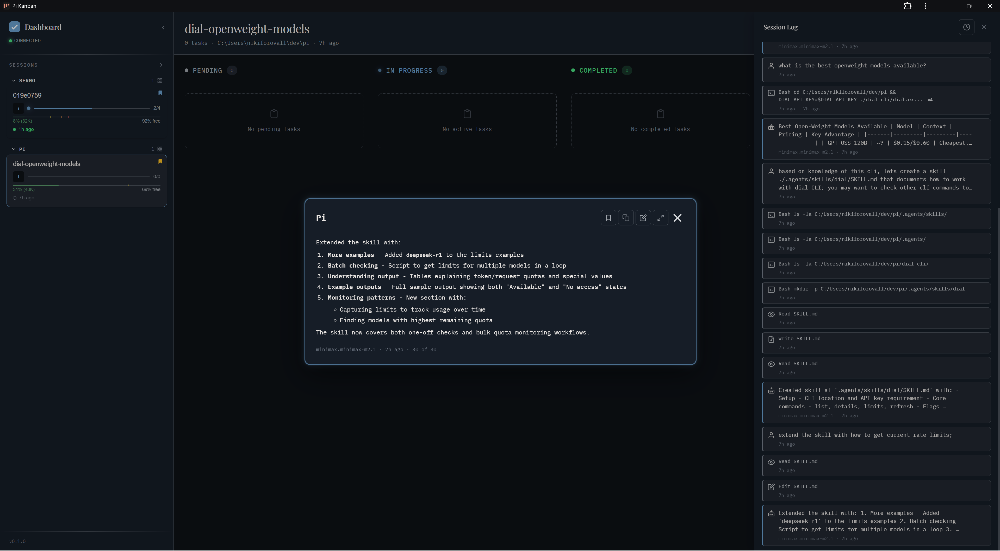
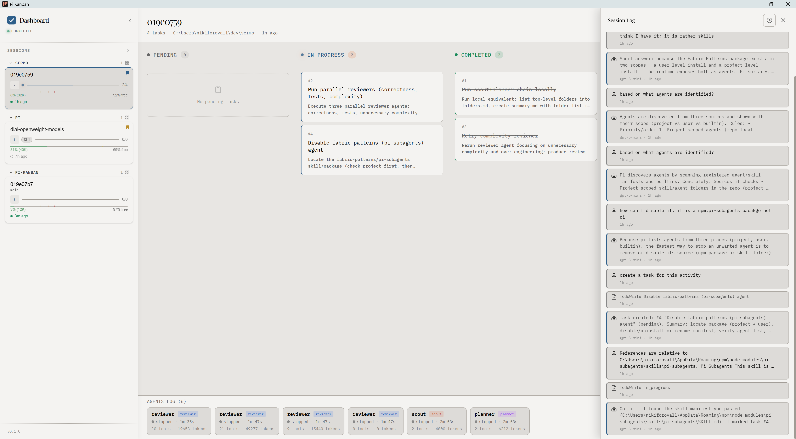

# pi-kanban user guide

A walkthrough of the dashboard and `/kanban` commands. For installation, see the [README](../README.md).

## Slash commands

Run from inside pi:

| Command                  | What it does                                                  |
| ------------------------ | ------------------------------------------------------------- |
| `/kanban start`          | Start the local server (port 3460) in the background          |
| `/kanban stop`           | Stop the running server                                       |
| `/kanban restart`        | Restart the server (picks up theme/config changes)            |
| `/kanban status`         | Show whether the server is running                            |
| `/kanban open`           | Open the dashboard in the default browser                     |
| `/kanban web`            | Print the dashboard URL                                       |
| `/kanban app`            | Open in a standalone PWA window (if installed)                |
| `/kanban pin <id>`       | Pin a session to the top of the sidebar                       |
| `/kanban sticky-pin <id>`| Pin and keep across restarts                                  |
| `/kanban unpin <id>`     | Remove a pin                                                  |
| `/kanban preview <path>` | Render a markdown file in the dashboard preview pane          |
| `/kanban link <id>`      | Print a deep link to a session                                |

## Layout

- **Left sidebar** — session list grouped by project. Each row shows progress, age, pin state.
- **Center** — kanban board (Pending / In Progress / Completed) for the selected session, populated from `@juicesharp/rpiv-todo`.
- **Right** — Session Log: all messages, tool calls, subagent activity. Auto-scrolls; click a message to expand.
- **Bottom strip** — recent subagent runs across sessions.

## Sessions and projects

pi-kanban reads `~/.pi/agent/sessions/<encoded-cwd>/<timestamp>_<id>.jsonl` and groups sessions by their working directory. Pinning lifts a session out of the auto-sort; sticky pins survive server restarts.

## Subagents

When `pi-subagents` spawns a child session, pi-kanban nests it under its parent and renders the agent's lifecycle (start, tool use, completion) inline.

## Session info

Click the info icon on any session for full metadata: model, token usage, cache hit rate, cost, duration, paths.

## Storage manager

The Storage Manager (toolbar icon) lists sessions, scratchpads, and linked docs with size accounting. Use it to clean orphaned docs or unlink stale references.

## Follow last message

Pop out the latest assistant message in a floating window — useful for monitoring long-running runs while you work elsewhere.

## Light mode

The dark/light toggle switches between the two themes configured in settings. See [Theming](./theming.md).

## Keyboard shortcuts

Press `?` in the dashboard for the full list. Common ones:

- `j` / `k` — next / previous session
- `g` — jump to top
- `/` — focus filter
- `t` — toggle dark/light
- `Esc` — close modal / clear selection
